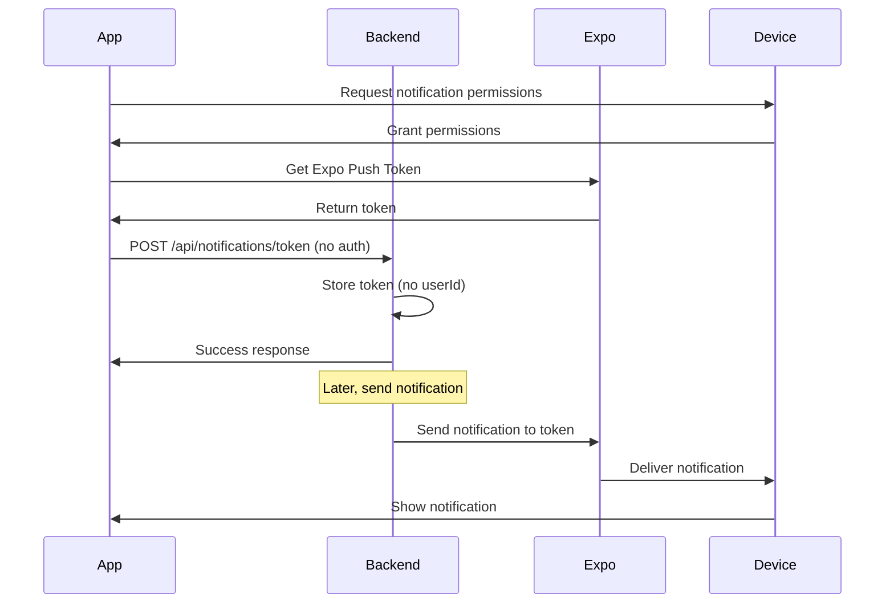
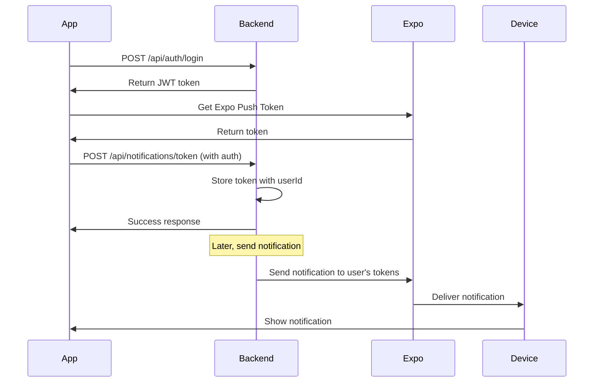

# Authentication & Push Notifications Guide

## 🔐 Authentication System

### User Registration & Login

The backend now includes a complete authentication system with JWT tokens.

#### **New Authentication Endpoints:**

| Method | Endpoint | Description | Auth Required |
|--------|----------|-------------|---------------|
| POST | `/api/auth/register` | Register new user | ❌ No |
| POST | `/api/auth/login` | Login user | ❌ No |
| GET | `/api/auth/profile` | Get user profile | ✅ Yes |
| PUT | `/api/auth/profile` | Update profile | ✅ Yes |
| PUT | `/api/auth/change-password` | Change password | ✅ Yes |
| GET | `/api/auth/verify` | Verify token | ✅ Yes |
| POST | `/api/auth/logout` | Logout user | ✅ Yes |

---

## 📱 Push Notifications & Authentication

### **Question: Do users need to be logged in to receive push notifications?**

**Answer: NO, users do NOT need to be logged in to receive push notifications.**

Here's why and how it works:

### 🔄 **Two Separate Systems:**

#### 1. **Authentication System** (Optional for notifications)
- **Purpose:** User management, profile, app features
- **Required for:** App login, user data, protected features
- **Not required for:** Push notifications

#### 2. **Push Notification System** (Independent)
- **Purpose:** Send notifications to devices
- **Works with:** Device tokens (Expo Push Tokens)
- **Independent of:** User login status

---

## 🏗️ **How It Works:**

### **Scenario 1: User NOT Logged In**
```
1. User opens app (not logged in)
2. App requests notification permissions
3. App gets Expo Push Token
4. App sends token to backend (no auth required)
5. Backend stores token with device info
6. Backend can send notifications to this token
7. User receives notifications even when not logged in
```

### **Scenario 2: User Logged In**
```
1. User logs in to app
2. App gets Expo Push Token
3. App sends token to backend WITH user ID
4. Backend links token to user account
5. Backend can send notifications to specific user
6. User receives personalized notifications
```

---

## 🔧 **Implementation Options:**

### **Option 1: Anonymous Notifications (No Login Required)**
```javascript
// Register token without user authentication
POST /api/notifications/token
{
  "token": "ExponentPushToken[xxxxx]",
  "deviceType": "android",
  "deviceInfo": {
    "brand": "Samsung",
    "modelName": "Galaxy S21"
  }
  // No userId required
}
```

### **Option 2: User-Linked Notifications (Login Required)**
```javascript
// Register token with user authentication
POST /api/notifications/token
{
  "userId": "user123",  // From authenticated user
  "token": "ExponentPushToken[xxxxx]",
  "deviceType": "android",
  "deviceInfo": {
    "brand": "Samsung",
    "modelName": "Galaxy S21"
  }
}
```

### **Option 3: Hybrid Approach (Recommended)**
```javascript
// Start anonymous, link to user when they login
// 1. Anonymous registration
POST /api/notifications/token
{
  "token": "ExponentPushToken[xxxxx]",
  "deviceType": "android"
}

// 2. Link to user when they login
PUT /api/notifications/token/link
{
  "token": "ExponentPushToken[xxxxx]",
  "userId": "user123"  // From login
}
```

---

## 📋 **Complete Flow Examples:**

### **Flow 1: Anonymous User Gets Notifications**



### **Flow 2: Logged-in User Gets Notifications**



---

## 🎯 **Best Practices:**

### **1. Start Anonymous, Link Later**
```javascript
// App startup (no login required)
const registerToken = async () => {
  const token = await Notifications.getExpoPushTokenAsync();
  
  // Register anonymously first
  await fetch('/api/notifications/token', {
    method: 'POST',
    headers: { 'Content-Type': 'application/json' },
    body: JSON.stringify({
      token: token.data,
      deviceType: Platform.OS,
      deviceInfo: { ... }
    })
  });
};

// When user logs in, link token to user
const linkTokenToUser = async (userId) => {
  const token = await Notifications.getExpoPushTokenAsync();
  
  await fetch('/api/notifications/token', {
    method: 'POST',
    headers: { 
      'Content-Type': 'application/json',
      'Authorization': `Bearer ${jwtToken}`
    },
    body: JSON.stringify({
      userId: userId,
      token: token.data,
      deviceType: Platform.OS
    })
  });
};
```

### **2. Handle Multiple Devices**
```javascript
// User can have multiple devices
// Each device gets its own token
// All tokens are linked to same userId

// Send to specific user (all their devices)
POST /api/notifications/send
{
  "userId": "user123",
  "title": "Hello!",
  "body": "Message for all your devices"
}
```

### **3. User Preferences**
```javascript
// Users can control notification preferences
PUT /api/notifications/token/:tokenId/preferences
{
  "allowNotifications": true,
  "allowSound": false,
  "allowVibration": true
}
```

---

## 🧪 **Testing Authentication:**

### **1. Register User**
```bash
curl -X POST http://localhost:3000/api/auth/register \
  -H "Content-Type: application/json" \
  -d '{
    "username": "testuser",
    "email": "test@example.com",
    "password": "password123",
    "firstName": "Test",
    "lastName": "User"
  }'
```

### **2. Login User**
```bash
curl -X POST http://localhost:3000/api/auth/login \
  -H "Content-Type: application/json" \
  -d '{
    "emailOrUsername": "test@example.com",
    "password": "password123"
  }'
```

### **3. Register Token (with auth)**
```bash
curl -X POST http://localhost:3000/api/notifications/token \
  -H "Content-Type: application/json" \
  -H "Authorization: Bearer YOUR_JWT_TOKEN" \
  -d '{
    "userId": "user123",
    "token": "ExponentPushToken[xxxxx]",
    "deviceType": "android"
  }'
```

### **4. Send Notification to User**
```bash
curl -X POST http://localhost:3000/api/notifications/send \
  -H "Content-Type: application/json" \
  -d '{
    "userId": "user123",
    "title": "Hello!",
    "body": "This is a test notification"
  }'
```

---

## 🔒 **Security Considerations:**

### **1. Token Security**
- JWT tokens expire after 7 days
- Tokens are signed with secret key
- Invalid tokens are rejected

### **2. Rate Limiting**
- Registration: 5 attempts per 5 minutes
- Login: 10 attempts per minute
- Notifications: 10 per minute

### **3. Data Protection**
- Passwords are hashed with bcrypt
- Sensitive data is not logged
- CORS is properly configured

---

## 📊 **Database Schema:**

### **Users Collection**
```javascript
{
  _id: ObjectId,
  username: String,
  email: String,
  password: String (hashed),
  firstName: String,
  lastName: String,
  isActive: Boolean,
  lastLogin: Date,
  loginCount: Number,
  preferences: {
    allowNotifications: Boolean,
    allowEmailNotifications: Boolean,
    language: String
  },
  role: String,
  createdAt: Date,
  updatedAt: Date
}
```

### **PushTokens Collection**
```javascript
{
  _id: ObjectId,
  userId: String (optional), // Can be null for anonymous
  token: String,
  deviceType: String,
  deviceInfo: Object,
  isActive: Boolean,
  lastUsed: Date,
  notificationCount: Number,
  preferences: Object,
  createdAt: Date,
  updatedAt: Date
}
```

---

## 🎉 **Summary:**

✅ **Push notifications work WITHOUT user login**
✅ **Authentication is OPTIONAL for notifications**
✅ **Users can receive notifications anonymously**
✅ **Login enables personalized notifications**
✅ **Multiple devices per user supported**
✅ **Complete JWT authentication system**
✅ **Secure and scalable architecture**

**The key point:** Push notifications are device-based, not user-based. The device token is what matters for delivery, not the user's login status.
